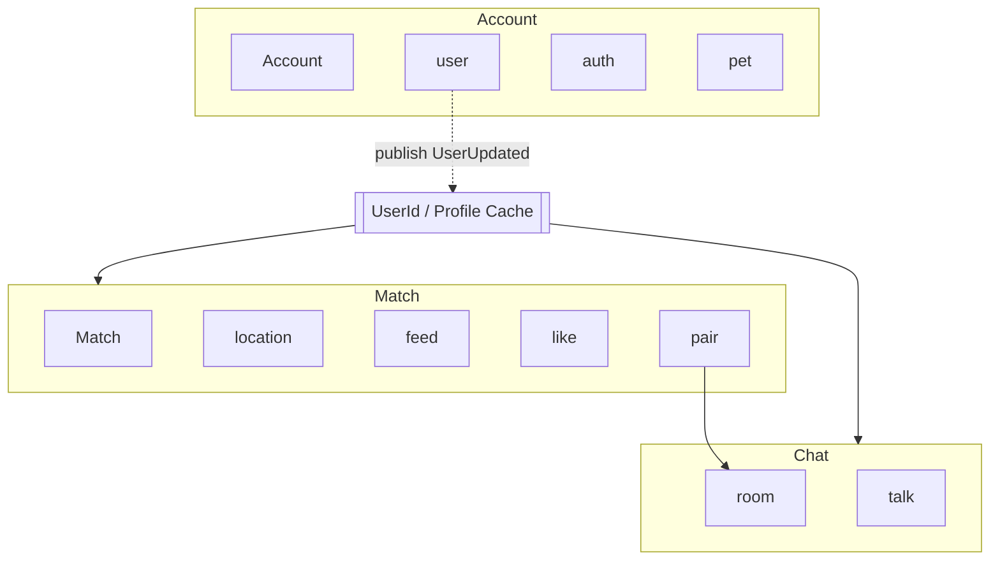

#  개개팅

## 📚 API 문서

[API Document 보러가기](https://kangjuhyup.github.io/gaegaeting/docs/#/)

## 🏗️ 바운디드 컨텍스트 구조

## 로그인
### 🔄 로그인 플로우

> 현재 본인인증을 제공하지 않습니다.  
> 각 소셜로 로그인 할 경우 각각 계정이 생성됩니다.

### 🔗 로그인 API 흐름

| 순서 | 작업 | 엔드포인트 | 설명 |
|:---:|------|------|------|
| 1 | **로그인 요청** | `GET /accounts/auth/{provider}` | 사용자를 소셜 로그인 페이지로 리다이렉트합니다. |
| 2 | **콜백 처리** | `POST /accounts/auth/{provider}/fallback` | 소셜 로그인 후 콜백을 처리하여 토큰을 발급합니다. |
| 3 | **사용자 정보 조회** | `GET /accounts/users/me` | 현재 로그인한 사용자 정보를 조회합니다. **주의**: 403 에러 반환 시 계정 생성이 필요합니다. |
| 4 | **계정 생성** | `POST /accounts/users/me` | 사용자 계정을 생성합니다. |
