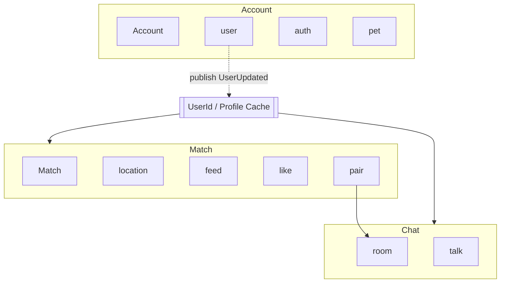
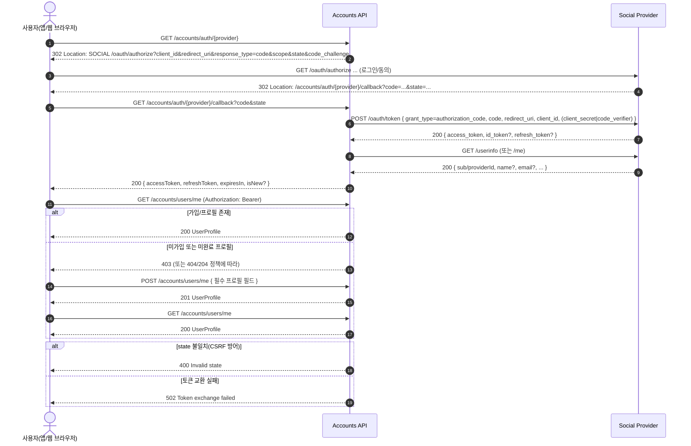

#  개개팅


## 📚 API 문서

[API Document 보러가기](https://kangjuhyup.github.io/gaegaeting/docs/#/)

## 🏗️ 바운디드 컨텍스트 구조

## 로그인
### 🔄 로그인 플로우

> 현재 본인인증을 제공하지 않습니다.  
> 각 소셜로 로그인 할 경우 각각 계정이 생성됩니다.


### 파일업로드 플로우
```
sequenceDiagram
  autonumber
  participant Client
  participant Server
  participant S3
  participant SNS
  participant DB
  participant Admin as Admin (or AI)

  Client->>Server: PresignedUrl 요청
  Server->>S3: PresignedUrl 생성
  Server->>DB: 첨부파일 엔티티 생성 (active: false)
  Server-->>Client: PresignedUrl 리턴
  Client->>S3: PresignedUrl 로 이미지 PUT
  S3->>SNS: 이미지 PUT 이벤트 발행


  rect rgba(255, 245, 200, .4)
    note over Client,Server: (6번 이전) 이미지 조회 시나리오
    Client->>Server: 이미지 조회 요청 (GET /attachments/{id})
    Server->>DB: 상태 조회
    alt 승인 전 (active=false)
      DB-->>Server: active=false
      Server-->>Client: "심사중인 이미지" (예: HTTP 202 + placeholder)
    else 승인 후 (active=true)
      DB-->>Server: active=true
      Server-->>Client: 원본 이미지/URL 반환 (HTTP 200)
    end
  end

  Admin->>S3: 이미지 검수
  Admin->>Server: 이미지 통과 API 호출
  Server->>DB: 첨부파일 엔티티 업데이트 (active: true)

    rect rgba(220,255,220,.35)
    note over Client,Server: 6번(승인) 이후 이미지 조회 플로우
    Client->>Server: 이미지 조회 요청 (GET /attachments/{id})
    Server->>DB: 상태 조회(active?) 및 objectKey 조회
    DB-->>Server: active=true & objectKey
    Server-->>Client: 이미지 원본 또는 Presigned GET URL (HTTP 200)
  end
```
