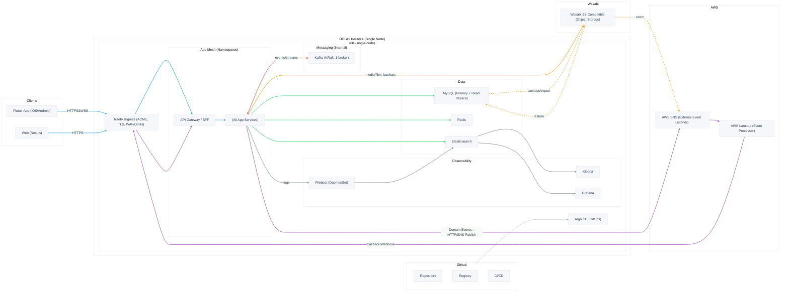

#  개개팅

## 📚 API 문서

[API Document 보러가기](https://kangjuhyup.github.io/gaegaeting/docs/#/)

## 아키텍쳐

```mermaid
%% 색 초기화(선택)
%%{init: {'theme':'base', 'themeVariables': {
  'primaryColor': '#f5f7fb', 'primaryTextColor':'#2c3e50', 'lineColor':'#95a5a6'
}}}%%

flowchart LR
  subgraph Clients["Clients"]
    M["Flutter App (iOS/Android)"]
    W["Web (Next.js)"]
  end

  subgraph OCI["OCI A1 Instance (Single Node)"]
    subgraph K3S["k3s (single-node)"]
      TR["Traefik Ingress (ACME, TLS, WAF/Limits)"]
      ARGO["Argo CD (GitOps)"]

      %% ── App 영역 ─────────────────────────────────────────
      subgraph Apps["App Mesh (Namespaces)"]
        GW["API Gateway / BFF"]
        APPS["(All App Services)"]
      end

      %% ── Data 영역(Elasticsearch 포함) ───────────────────
      subgraph Data["Data"]
        MYSQL["MySQL (Primary + Read Replica)"]
        REDIS["Redis"]
        ES["Elasticsearch"]
      end

      %% ── Observability/Log ───────────────────────────────
      subgraph Observability["Observability"]
        KB["Kibana"]
        FB["Filebeat (DaemonSet)"]
        GRAF["Grafana"]
      end

      %% ── Messaging(내부) ─────────────────────────────────
      subgraph Messaging["Messaging (Internal)"]
        KAFKA["Kafka (KRaft, 1 broker)"]
      end
    end
  end

  %% ── 외부 서비스 분리 ────────────────────────────────────
  subgraph AWS["AWS"]
    SNS["AWS SNS (External Event Listener)"]
    LAMBDA["AWS Lambda (Event Processor)"]
  end

  subgraph WASABI_EXT["Wasabi"]
    WASABI["Wasabi S3-Compatible (Object Storage)"]
  end
  
  subgraph GITHUB["Github"]
	  REPOSITORY["Repository"]
	  REGISTRY["Registry"]
	  WORKFLOW["CI/CD"]
	end

  %% ── Edges (Ingress/API) ─────────────────────────────────
  M -->|HTTPS&WSS| TR
  W -->|HTTPS| TR
  TR --> GW
  GW --> APPS

  %% ── Data 접근 ───────────────────────────────────────────
  APPS --> MYSQL
  APPS --> REDIS
  APPS --> ES

  %% ── Storage (Wasabi) ────────────────────────────────────
  APPS -->|media/files, backups| WASABI
  MYSQL -. backups/export .-> WASABI
  WASABI -. restore .-> MYSQL
  WASABI -. event .-> SNS

  %% ── Messaging / Events (외부 AWS) ───────────────────────
  APPS -->|Domain Events : HTTP/SNS Publish| SNS
  SNS --> LAMBDA
  LAMBDA -->|Callback/Webhook| TR
  TR --> GW

  %% ── Observability ───────────────────────────────────────
  APPS -->|logs| FB
  FB --> ES
  ES --> KB
  ES --> GRAF

  %% ── Kafka ↔ App 서비스 연결 ─────────────────
  APPS <-->|events/streams| KAFKA
  
  %% ── GitOps 연결 ─────────────────
  GITHUB --> ARGO

%% ─────────────────────────────────────────────────────────
%% linkStyle: 선언된 순서대로 0부터 색 적용
%% 0-3: Ingress/API (파랑)
linkStyle 0,1,2,3 stroke:#1DA3DD,stroke-width:2px;

%% 4-6: Data 접근 (초록)
linkStyle 4,5,6 stroke:#2ECC71,stroke-width:2px;

%% 7-10: Wasabi(Storage) (주황) / 점선은 백업/복구/이벤트
linkStyle 7 stroke:#F39C12,stroke-width:2px;
linkStyle 8,9,10 stroke:#F39C12,stroke-width:2px,stroke-dasharray: 5 5;

%% 11-14: AWS 메시징 경로 (보라)
linkStyle 11,12,13,14 stroke:#9B59B6,stroke-width:2px;

%% 15-18: Observability (회색)
linkStyle 15,16,17,18 stroke:#7F8C8D,stroke-width:2px;

%% 19: Kafka 내부 이벤트 (빨강)
linkStyle 19 stroke:#E74C3C,stroke-width:2px;
```