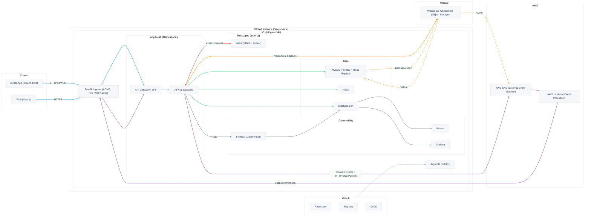

#  개개팅


## 📚 API 문서

[API Document 보러가기](https://kangjuhyup.github.io/gaegaeting/docs/#/)

## 아키텍쳐

## 로컬 환경 구성

### 1. Doppler 설치 및 연동

#### Doppler CLI 설치
```bash
# macOS
brew install dopplerhq/cli/doppler

# Linux
(curl -Ls --tlsv1.2 --proto "=https" --retry 3 https://cli.doppler.com/install.sh || wget -t 3 -qO- https://cli.doppler.com/install.sh) | sudo sh

# Windows (PowerShell)
# https://docs.doppler.com/docs/install-cli 참고
```

#### Doppler 로그인 및 설정
```bash
# 1. Doppler 로그인
doppler login

# 2. 프로젝트 루트에서 Doppler 설정
doppler setup

# 3. 설정 확인
doppler run -- env | grep DOPPLER
```

#### 각 서비스별 환경변수 사용
```bash
# Account 서비스 실행
doppler run -- yarn workspace account start:dev

# Match 서비스 실행
doppler run -- yarn workspace match start:dev

# Chat 서비스 실행
doppler run -- yarn workspace chat start:dev
```

### 2. Docker Compose로 인프라 구동

#### 필수 인프라 서비스 시작
```bash
# 모든 인프라 서비스 시작 (MySQL, Redis, Kafka 등)
docker-compose up -d

# 특정 서비스만 시작
docker-compose up -d mysql redis

# 서비스 상태 확인
docker-compose ps

# 로그 확인
docker-compose logs -f [service-name]
```

#### 인프라 서비스 종료
```bash
# 모든 서비스 종료 (데이터 유지)
docker-compose down

# 모든 서비스 종료 및 볼륨 삭제 (데이터 삭제)
docker-compose down -v
```

#### 주요 서비스 접속 정보
- **MySQL**: `localhost:3306`
- **Redis**: `localhost:6379`
- **Kafka**: `localhost:9092`

## Typescript 프로젝트 
### 실행 방법
```bash
# yarn berry typescript sdk 설치
yarn dlx @yarnpkg/sdks vscode
# 프로젝트 의존성 설치
yarn
# 프로젝트 실행 (ex. account )
yarn workspace account run:dev
```
### Core 모듈 패키지 적용 방법
1. 각 프로젝트 package.json 에 dependency 추가
```json
"dependencies": {
  "@core/database": "*",
  // @core/database 의 peerDependencies에 선언된 패키지도 추가 필요
}
```
2. Core 모듈 빌드
```bash
yarn workspace @core/database build
```
3. 패키지내 필요한 파일에 모듈 import
```javasacript
import { DatabaseModule } from '@core/database';
```
3-1. 경로 에러가 날 경우 대처 방법
- 루트의 tsconfig.json 에 paths 에 모듈 경로가 존재하는지 확인
```json
"paths": {
  "@core/database/*": ["packages/core/database/src/*"],
}
```
- typescript 서버 재실행